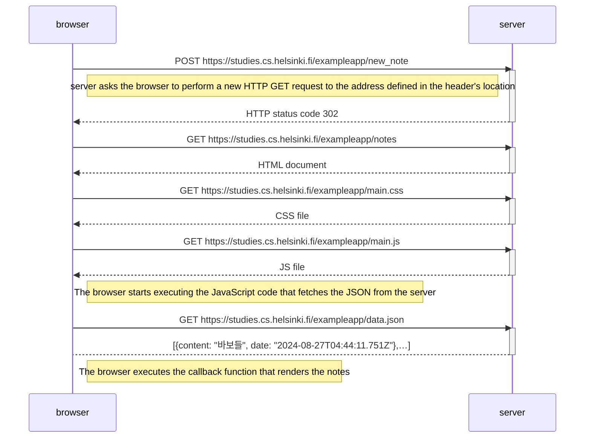

```mermaid
sequenceDiagram
	participant browser
	participant server
	
	browser->>server: POST https://studies.cs.helsinki.fi/exampleapp/new_note
	activate server
	Note left of server: server asks the browser to perform a new HTTP GET request to the address defined in the header's location
	server-->>browser: HTTP status code 302
	deactivate server
	
	browser->>server: GET https://studies.cs.helsinki.fi/exampleapp/notes
	activate server
	server-->>browser: HTML document
	deactivate server
	
	browser->>server: GET https://studies.cs.helsinki.fi/exampleapp/main.css
	activate server
	server-->>browser: CSS file
	deactivate server
	
	browser->>server: GET https://studies.cs.helsinki.fi/exampleapp/main.js
	activate server
	server-->>browser: JS file
	deactivate server

	Note right of browser: The browser starts executing the JavaScript code that fetches the JSON from the server

	
	browser->>server: GET https://studies.cs.helsinki.fi/exampleapp/data.json
	activate server
	server-->browser: [{content: "바보들", date: "2024-08-27T04:44:11.751Z"},…]
	deactivate server

	Note right of browser: The browser executes the callback function that renders the notes

```